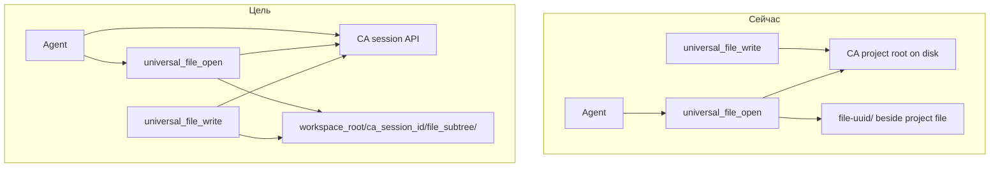

# Анализ кода: разрыв с source_spec (thin AI Editor Server)

План: `docs/plans/ai-editor-thin-server/`  
Источник требований: `source_spec.md`  
MRS: `spec.yaml`

Документ фиксирует **текущее состояние кода**, **целевое поведение** и **области изменений** для уровней G/T/A. Код не менялся.

---

## Сводка разрывов

| Область | Сейчас | Цель (source_spec) | Критичность |
|---------|--------|-------------------|-------------|
| Раскладка на диске | `{project_file_dir}/{name}-{uuid}/` рядом с файлом на диске СА | `{workspace_root}/{ca_session_id}/…` | Критично |
| Идентификатор сессии | UUID группы, выдаётся редактором (`session.py`) | `session_id` СА от агента | Критично |
| Блокировки / I/O | Локальный `.write` + прямой R/W в дерево проекта СА | Только API СА (lock, transfer, unlock) | Критично |
| MCP-поверхность | ~30 команд | `universal_file_*` + `health` + `queue_health` | Высокая |
| Upstream-клиент | `list_projects`, `list_project_files`, `get_project_root` | + validate session, open/close file, transfer | Высокая |
| Конфиг workspace | `editor_workspace_dir` в container JSON, **не читается кодом** | `workspace_root` в рантайме | Средняя |

---

## 1. Каталог сессии и пути (C-005, C-006, C-018)

### Где сейчас

| Файл | Строки / суть |
|------|----------------|
| `ai_editor/core/edit_session/edit_session.py` | `session_dir = source_abs.parent / f"{source_abs.name}-{session_id}"` — каталог **рядом с каноническим файлом** на диске проекта |
| `ai_editor/commands/universal_file_edit/open_command.py` | Резолв пути через `get_project_root()` → чтение/создание файла **на диске СА** |
| `ai_editor/commands/universal_file_edit/format_group.py` | `draft_path`, `lockfile_path` — рядом с каноническим файлом в проекте |
| `ai_editor/core/storage_paths.py` | DB, FAISS, locks, trash — **нет** `workspace_root` |
| `config/ai_editor_container.json` | `ai_editor.storage.editor_workspace_dir` — **не используется** в Python |

### Что менять

1. **Новый резолвер путей** (концепт C-018): например `ai_editor/core/editor_workspace_paths.py` или расширение `storage_paths.py`:
   - `workspace_root()` из `config.json` / `ai_editor.storage.editor_workspace_dir`
   - `session_dir(ca_session_id)` → `{workspace_root}/{ca_session_id}/`
   - `file_subtree(ca_session_id, project_id, file_path)` → подкаталог файла внутри сессии
   - `origin_path(...)`, `edit_subdir(...)` — явное разделение C-007 / C-008

2. **`EditSession.open()`** (`edit_session.py`): параметр `session_root: Path` вместо `source_abs.parent`; не создавать каталоги в дереве проекта СА.

3. **`format_group.py`**: пути draft/lockfile относительно Edit Subdirectory, не канонического файла проекта.

4. **Docker/Debian**: убедиться, что volume смонтирован на тот же путь, что в конфиге (`config/ai_editor_container.json`, deb-пакет).

### Зависимости

- G-001 (глобальный шаг): workspace и модель каталога сессии.

---

## 2. Идентификатор сессии и реестр файлов (C-004, C-006)

### Где сейчас

| Файл | Поведение |
|------|-----------|
| `ai_editor/commands/universal_file_edit/session.py` | `create_session()` выделяет `uuid4()` если `group_session_id` не передан; индекс `(project_id, file_path) → group_id` только в памяти |
| `open_command.py` | Опциональный `session_id` = **группа редактора**, не CA session |
| `tests/test_multi_file_session.py` | Тесты multi-file на editor UUID + локальные `client_sessions` locks |

### Что менять

1. **`universal_file_open` schema**: обязательный `session_id` = **CA session id** (переименование параметра в схеме — на уровне T/A; семантика фиксирована в G-003).

2. **`session.py`**:
   - Убрать автогенерацию group UUID; ключ bundle = `ca_session_id`.
   - Привязать bundle к `Editor Session Directory` на диске.
   - `release_session` / пустой bundle → удаление `{workspace_root}/{ca_session_id}/` если последний файл.

3. **Зомби-каталоги** (C-015): при невалидной сессии СА — `shutil.rmtree(session_dir)` + очистка `_session_bundles`.

### Зависимости

- G-001, G-002, G-003.

---

## 3. Upstream Client (C-017, C-014)

### Где сейчас

| Файл | Реализовано |
|------|-------------|
| `ai_editor/core/upstream/code_analysis_client.py` | `list_projects`, `get_project`, `get_project_root`, `resolve_file_by_id`, generic `call()` |
| Вызовы в коде | Только discovery/path resolve; **нет** `session_open_file`, transfer, validate |

Transfer/lock сегодня: `project_file_transfer_*_commands.py` + **локальный диск** под `get_project_root()`.

### Что менять

1. Расширить `CodeAnalysisClient` методами (имена команд СА — уточнить по `help` СА на этапе T):
   - `validate_session(session_id)` или эквивалент
   - `session_open_file(session_id, project_id, file_path)` — download + lock
   - `session_close_file(session_id, project_id, file_path)` — unlock
   - `transfer_download_*` / `transfer_upload_*` — если open/close не покрывают upload

2. **Централизованный guard** (middleware или helper): `assert_ca_session_valid()` перед open/edit/preview; ветвление broken-session для write/close.

3. **Убрать** использование `get_project_root()` для read/write/edit в thin-режиме (оставить только для валидации project_id при необходимости).

### Зависимости

- G-002.

---

## 4. universal_file_open (C-010)

### Где сейчас

`open_command.py` (~600 строк):

- Резолв `abs_path` на диске проекта СА
- `create_session(abs_path, …)` → core EditSession рядом с файлом
- Локальный lockfile `.write`, без CA lock/download
- Sidecar `.cst_sidecar` / `.draft` рядом с каноническим файлом

### Целевой порядок (source_spec {7m3q})

1. Validate CA session
2. `mkdir -p {workspace_root}/{session_id}/`
3. CA: open file + download с блокировкой
4. Записать **Origin Snapshot** в File Subtree
5. Создать **Edit Subdirectory** + core EditSession (существующая CST/draft схема)
6. Вернуть `session_id`, `file_path`, `core_session_id`, `session_dir`, `draft_path` (пути внутри workspace)

### Файлы для правок

| Файл | Изменение |
|------|-----------|
| `open_command.py` | Оркестрация CA + workspace paths |
| `open_command_metadata.py` / schema | Обязательный `session_id` (CA), `project_id`, `file_path` |
| `session.py` | `create_session` принимает `ca_session_id`, `origin_path`, `edit_root` |
| `edit_session.py` | `open(session_root=…)` |
| `tree_temp_open_support.py`, `sidecar` paths | Пути относительно edit subdir |

### Зависимости

- G-001, G-002, G-003.

---

## 5. universal_file_edit / preview (C-011, C-019)

### Где сейчас

| Файл | Статус |
|------|--------|
| `edit_command.py` | Мутирует draft в session; **логика edit в целом пригодна** |
| `universal_file_preview_command.py` + `commands/universal_file_preview/` | Read-only; merge с open session |
| CST, tree-temp, format groups | Внутренний движок — **сохранить** ({7r6m}) |

### Что менять

- Минимально: убедиться, что `abs_path` / `draft_path` в facade указывают на пути **внутри workspace**, не на проект СА.
- Preview: guard CA session validation.
- **Не трогать** семантику batch edit, sidecar, tree-temp — только базовые пути и session lookup.

### Зависимости

- G-004 (после G-003).

---

## 6. universal_file_write (C-012)

### Где сейчас

`write_command.py`:

- Сравнение draft vs **канонический файл на диске проекта** (`session.abs_path`)
- Commit: `os.replace` в дерево СА + backup + optional git
- Двухфазный протокол с lockfile `.write`
- **Нет** no-op при неизменённом содержимом относительно origin
- **Нет** CA upload

### Целевое поведение

1. Сравнить **Origin Snapshot** vs содержимое Edit Subdirectory (draft/generated).
2. Equal → `{success: true, unchanged: true}`, без RPC к СА.
3. Diff → CA upload; при success → перезаписать Origin Snapshot; draft остаётся для дальнейшего edit.
4. Ошибка СА → не менять origin.

### Файлы

| Файл | Изменение |
|------|-----------|
| `write_command.py` | Новая ветка compare + upstream upload |
| `write_command_metadata.py` | Документировать no-op |
| `invalid_write_support.py`, `sha_sync_policy.py` | Адаптировать к origin vs edit |
| `edit_session.py` | Убрать/не использовать `confirm_external_copy_out` в project tree |

### Зависимости

- G-005 (после G-003, G-004).

---

## 7. universal_file_close (C-013)

### Где сейчас

`close_command.py`:

- Локальная очистка sidecar/draft, `core.close()` удаляет `{file}-{uuid}/`
- **Нет** `session_close_file` на СА
- **Нет** удаления File Subtree / session root

### Целевое поведение

1. CA: `session_close_file` (unlock)
2. Success → `rmtree` File Subtree (origin + edit subdir)
3. Если файлов в bundle не осталось → `rmtree` `{workspace_root}/{session_id}/`
4. Очистить `_session_bundles`, `_file_open_index`

### Файлы

`close_command.py`, `session.py` (`release_session`), metadata.

### Зависимости

- G-003 (close — часть того же G или отдельный G-006).

---

## 8. Broken session (C-014, C-015)

### Где сейчас

**Отсутствует** в `universal_file_*`.

### Что добавить

- `ai_editor/core/upstream/session_guard.py` (или в client): validate + политика отказа
- Вызов из open/edit/preview (reject), write/close (ограниченно разрешено)
- При `SESSION_NOT_FOUND` от СА → cleanup workspace dir

### Зависимости

- G-002, G-007.

---

## 9. MCP-регистрация (C-016, C-020)

### Где сейчас

| Файл | Команды |
|------|---------|
| `hooks_register_part2.py` | universal_file_* (+ move_nodes, search, git×5, undo/redo, session_write), session_*×7, subordinate×5 |
| `commands/registration.py` | transfer×2, advisory_lock, lock_status |
| `hooks_register_part1.py` | health, queue_health ✓ |

### Оставить на MCP

- `health`, `queue_health`
- `universal_file_open`, `edit`, `write`, `close`, `preview`

### Снять с MCP (код может временно остаться для внутреннего reuse)

| Команда | Модуль |
|---------|--------|
| `project_file_transfer_*` | `project_file_transfer_by_id_commands.py` |
| `project_file_advisory_lock_batch`, `project_file_lock_status` | соответствующие `*_command.py` |
| `session_create/delete/list/view` | `commands/sessions/` |
| `session_open_file/close_file/list_file_locks` | `commands/sessions/` |
| `subordinate_session_*` | `subordinate_session_commands.py` |
| `universal_file_move_nodes`, `universal_file_search` | `move_nodes_command.py`, `search_command.py` |
| `session_git_*`, `session_undo/redo`, `session_write` | `session_git_*`, `session_*_command.py` |

### Файлы

`hooks_register_part2.py`, `hooks.py` (auto-import), `commands/registration.py`.

### Зависимости

- G-006 (после стабилизации open/write/close).

---

## 10. Клиентская библиотека (C-020, {4z1r})

### Где сейчас

| Файл | Проблема |
|------|----------|
| `client/ai_editor_client/client.py` | Три фасада: `universal_files`, `file_sessions`, `editor_files` |
| `client/ai_editor_client/universal_file.py` | Нет обязательного CA `session_id` |
| `client/ai_editor_client/file_session.py` | session_* + transfer API |
| `client/ai_editor_client/editor_file.py` | 5-step client-side staging |
| `client/ai_editor_client/local_edit_workspace.py` | `{baseline}-{uuid}/` рядом с baseline |
| `client/ai_editor_client/server_api.py` | `CLIENT_FACADE_COMMANDS` включает session/transfer |

### Что менять

- Единый `UniversalFileClient` с обязательным `session_id` (CA).
- Deprecate/remove `FileSessionClient`, `EditorFileClient`, `LocalEditWorkspace`.
- Обновить `server_api.py`, examples, `assert_facade_commands_registered`.

### Зависимости

- G-008 (после G-006).

---

## 11. Legacy: in-memory sessions, DB, workers (C-020)

### Модули к удалению (после отвязки от MCP и open/write/close)

| Путь | Назначение |
|------|------------|
| `ai_editor/core/client_sessions.py` | In-memory CA session emulation |
| `ai_editor/core/subordinate_sessions.py` | Subordinate links |
| `ai_editor/core/runtime_lock_sessions.py` | Advisory leases |
| `ai_editor/core/transfer_lock_registry.py` | Transfer hooks |
| `ai_editor/core/session_view.py` | Session view helper |
| `ai_editor/commands/sessions/` | Весь пакет MCP session |
| `ai_editor/core/database/file_edit_lock.py` | DB-era lock |

### Workers / CLI остатки

| Путь | Заметка |
|------|---------|
| `ai_editor/cli/server_manager_cli.py` | PID indexing/vectorization/file_watcher |
| `ai_editor/main.py`, `main_cleanup.py` | Queue init |

### Зависимости

- G-009 (финальная зачистка).

---

## 12. Тесты

### Сохранить / адаптировать

| Файл | Действие |
|------|----------|
| `tests/test_multi_file_session.py` | Переписать: CA session id + workspace layout + mock upstream |
| `tests/test_universal_file_edit_command.py` | Пути в tmp workspace |
| `tests/test_text_universal_edit_write_close.py` | + no-op write, + CA mock |
| `tests/test_tree_temp_universal_*` | Внутренний движок — пути |
| `tests/unit/test_edit_session_lifecycle.py` | `session_root` параметр |
| `tests/mcp/test_universal_file_mcp_regression.py` | Обновить контракт |

### Удалить / карантин

`test_session_git_*`, `test_session_write_command.py`, `test_session_undo_redo.py`, `test_universal_file_search_command.py`, `test_editor_file_client.py`, `test_universal_file_save_command.py`.

### Новые интеграционные сценарии (критерии {2a8s})

1. Open → edit → write (unchanged) → close — без RPC upload
2. Open → edit → write (changed) → close — upload + origin sync
3. Два файла в одной CA session под одним `{workspace_root}/{id}/`
4. Вторая CA session не может open тот же файл (mock lock error)
5. Broken session: edit rejected, close cleans workspace

### Зависимости

- G-010 (acceptance).

---

## Диаграмма: сейчас → цель

---

## Рекомендуемый порядок реализации (маппинг на G-шаги)

| Порядок | G-step | Смысл |
|---------|--------|-------|
| 1 | G-001 | workspace_root + резолвер путей + модель File Subtree |
| 2 | G-002 | Upstream client + session guard |
| 3 | G-003 | open: CA download + layout; close: CA unlock + cleanup |
| 4 | G-004 | edit/preview: пути в workspace, без смены edit-семантики |
| 5 | G-005 | write: compare origin vs edit, no-op, CA upload |
| 6 | G-007 | broken session policy + zombie cleanup |
| 7 | G-006 | снять лишние MCP-команды |
| 8 | G-008 | единый клиент |
| 9 | G-009 | удалить legacy modules |
| 10 | G-010 | тесты и приёмка |

---

## Следующие уровни плана

- **cycle_1**: сверка `spec.yaml` ↔ `source_spec.md` (все `{xxxx}` покрыты concepts).
- **cycle_2**: автономность каждого G-step triple.
- **T-steps**: декомпозиция G → tactical (сущности/модули, без имён функций в TS — по стандарту).
- **A-steps**: после overall_green tactical layer — один файл на AS.
